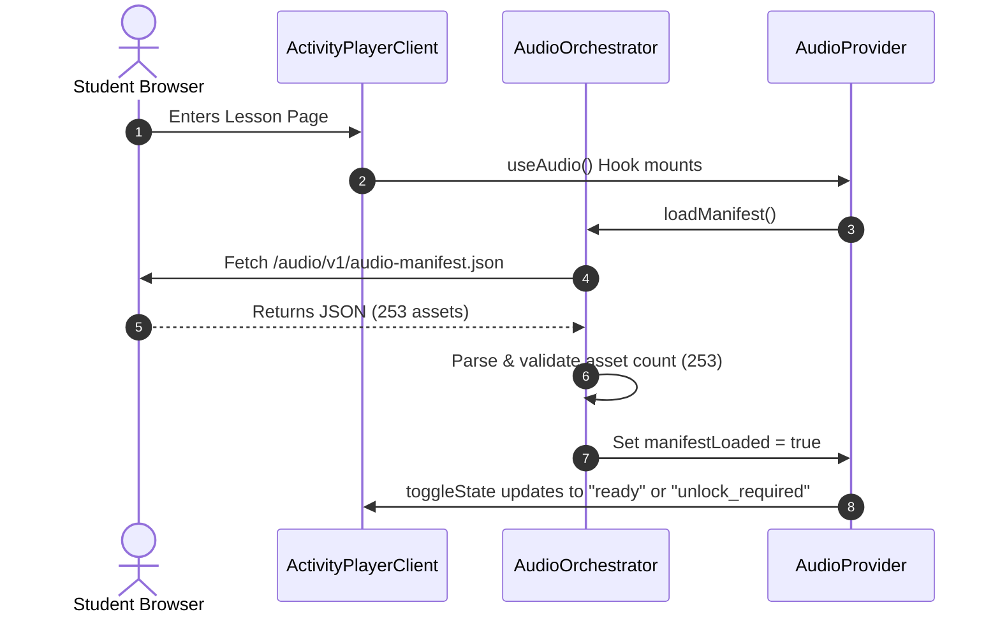
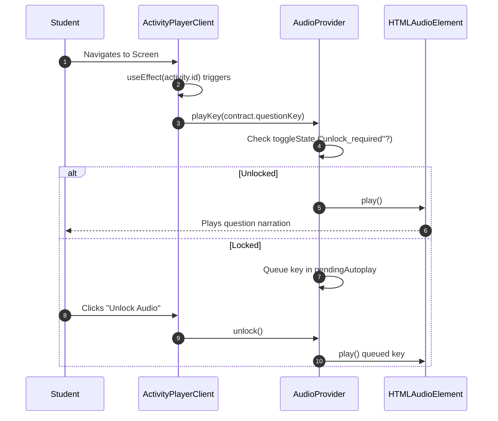

# Audio Architecture Analysis

This report provides a comprehensive, read-only analysis of the audio system in `D:\arabic-adventures`. It documents the data flow, directory structure, manifest schema, component hierarchy, and the lifecycle of audio events (autoplay, answer clicks, and submission feedback). It also details the pre-remediation defects and provides the foundation for the remediation blueprint.

---

## 1. Repository Audio Structure

The table below lists all active and legacy audio-related directories and files in the repository.

| Purpose | Exact Path | Active/Legacy | Imported By | Reads From | Writes To |
| :--- | :--- | :--- | :--- | :--- | :--- |
| Production Audio Assets | `public/audio/v1/` | **Active** | Browser Runtime | - | - |
| Production Audio Manifest | `public/audio/v1/audio-manifest.json` | **Active** | `audio-orchestrator.ts` | - | - |
| Edge-TTS Generation Pipeline | `development/audio/edge-tts/` | **Active** (Tooling) | - | `development/audio/edge-tts/src/` | `public/audio/v1/` |
| Audio Staging Area | `development/audio/edge-tts/staging/` | **Active** (Tooling) | - | `development/audio/edge-tts/cache/` | `public/audio/v1/` |
| Archived Gemini Tooling | `development/audio/archive/gemini/` | *Legacy/Archive* | - | - | - |
| Archived Azure Tooling | `development/audio/archive/azure/` | *Legacy/Archive* | - | - | - |
| Audio Runtime Orchestrator | `src/audio/` | **Active** | `ActivityPlayerClient.tsx` | `public/audio/v1/` | - |
| Audio Context & Providers | `src/components/audio/` | **Active** | `src/app/layout.tsx` | `useAudio` | - |
| Student Activity Player | `src/components/activity/` | **Active** | `lessons/[lessonSlug]/` | - | - |
| Activity Game Renderers | `src/components/activity/renderers/` | **Active** | `ActivityRenderer.tsx` | - | - |
| Backend Evaluation Service | `src/server/services/` | **Active** | `/api/activities/submit` | - | - |
| Lesson & Activity Definitions | `src/content/` | **Active** | `seed.ts`, `audit-all-runtime-audio.ts` | - | - |
| Project Verification Scripts | `scripts/` | **Active** (Tooling) | - | - | `development/audio/edge-tts/reports/` |
| NPM Script Definitions | `package.json` | **Active** | - | - | - |

---

## 2. Audio-Generation Flow

The diagram below illustrates the exact path of an audio asset from the script to the production WAV file:

```mermaid
flowchart LR
  ScriptIndex["Script Index<br/>(scripts-index.json)"] -->|Trace| TXT["Canonical TXT<br/>(ar-EG-SalmaNeural)"]
  TXT -->|Synthesize| EdgeGenerator["Edge TTS Generator<br/>(generate_audio.py)"]
  EdgeGenerator -->|Output| MP3["Temporary MP3<br/>(cache/)"]
  MP3 -->|Convert| FFmpeg["FFmpeg Conversion"]
  FFmpeg -->|Output| StagingWAV["Staging WAV<br/>(staging/)"]
  StagingWAV -->|Validate| Validation["Technical Validation<br/>(validate_assets.py)"]
  Validation -->|Copy| ProductionWAV["Production WAV<br/>(public/audio/v1/)"]
  ProductionWAV -->|Register| Manifest["Production Manifest<br/>(audio-manifest.json)"]
```



### Flow Details per Stage

1. **Canonical Script Index**
   * **Source File:** `development/audio/edge-tts/src/scripts-index.json`
   * **Input:** Manual text transcripts.
   * **Output:** JSON list of keys and texts.
   * **Failure Behavior:** Generation aborts if JSON is malformed.

2. **Canonical TXT File**
   * **Source File:** `development/audio/edge-tts/src/txt/**/*.txt`
   * **Input:** Script index entries.
   * **Output:** Unicode Arabic text files.

3. **Edge TTS Generator**
   * **Source File/Function:** `development/audio/edge-tts/src/generator.py` (`generate_speech`)
   * **Input:** Unicode TXT files.
   * **Output:** `development/audio/edge-tts/cache/**/*.mp3`
   * **Voice Config:** `ar-EG-SalmaNeural` (Microsoft Edge Online TTS).
   * **Resume Behavior:** Skips already synthesized MP3 files based on hash matching.

4. **FFmpeg Conversion**
   * **Source File/Function:** `development/audio/edge-tts/src/converter.py` (`convert_to_wav`)
   * **Input:** `development/audio/edge-tts/cache/**/*.mp3`
   * **Output:** `development/audio/edge-tts/staging/**/*.wav`
   * **Format Config:** WAV, 24000Hz, Mono, 16-bit PCM.

5. **Technical Validation**
   * **Source File/Function:** `development/audio/edge-tts/src/validator.py` (`validate_wav_properties`)
   * **Input:** `development/audio/edge-tts/staging/**/*.wav`
   * **Output:** Validation report JSON.
   * **Checks:** Sample rate, bit depth, channels, file size, silence detection.

6. **Production WAV & Manifest Registration**
   * **Source File/Function:** `development/audio/edge-tts/src/publisher.py` (`publish_assets`)
   * **Input:** `development/audio/edge-tts/staging/**/*.wav`
   * **Output:** `public/audio/v1/**/*.wav` and `public/audio/v1/audio-manifest.json`

---

## 3. Production Manifest

The manifest file `public/audio/v1/audio-manifest.json` acts as the single source of truth for the browser runtime.

### Manifest Schema

* **`version`**: Schema version (string, e.g., `"1"`).
* **`assets`**: Dictionary where keys are semantic keys and values are asset metadata:
  * **`src`**: Relative web path to the WAV file (e.g., `/audio/v1/lessons/magdi-yacoub/story.wav`).
  * **`text`**: The Arabic text transcription.
  * **`duration`**: Duration in seconds (float).
  * **`hash`**: SHA-256 hash of the audio file.
  * **`voice`**: Voice identifier (`ar-EG-SalmaNeural`).
  * **`provider`**: Speech provider (`microsoft-edge-online-tts`).

### Statistics

* **Total Speech Entries:** 250
* **Total SFX Entries:** 3 (`global.sfx.correct`, `global.sfx.incorrect`, `global.sfx.completion`)
* **Total Manifest Entries:** 253
* **Lesson-Specific Speech Entries:** 241
* **Global Speech Entries:** 9
* **Question Entries:** 47
* **Answer Entries:** 100
* **Instruction Entries:** 47
* **Story Entries:** 2
* **Spoken-Feedback Entries:** 51

### Runtime Manifest Loading



* **Loader Path:** [audio-orchestrator.ts](file:///d:/arabic-adventures/src/audio/runtime/audio-orchestrator.ts)
* **Fetch URL:** `/audio/v1/audio-manifest.json`
* **Storage Location:** Private class property in `AudioOrchestrator`, exposed via React Context `AudioProvider`.
* **Caching Behavior:** Browser standard HTTP cache.
* **Lookup Method:** `AudioOrchestrator.getAsset(key)`

---

## 4. Activity-Content Model

The lesson and activity content is defined statically in TypeScript files:
* **Ancient Egyptian Teacher (Lesson 1):** [lesson-activity-definitions.ts](file:///d:/arabic-adventures/src/content/lesson-activity-definitions.ts)
* **Magdi Yacoub (Lesson 2):** [lesson-activity-definitions.ts](file:///d:/arabic-adventures/src/content/lesson-activity-definitions.ts)

### Screen and Renderer Mapping

| Lesson | Total Activities | Total Screens | Choice | Matching | Ordering | Checklist | SelfAssessment | OpenText |
| :--- | :---: | :---: | :---: | :---: | :---: | :---: | :---: | :---: |
| Lesson 1 | 24 | 24 | 11 | 2 | 2 | 2 | 2 | 5 |
| Lesson 2 | 23 | 23 | 11 | 2 | 2 | 2 | 1 | 5 |
| **Total** | **47** | **47** | **22** | **4** | **4** | **4** | **3** | **10** |

---

## 5. Semantic-Key Construction

Pre-remediation, semantic keys were constructed in a fragmented manner. The table below shows the key resolution logic.

### Key Naming Conventions

* **Questions:** `{prefix}-{activitySlug}-prompt`
* **Instructions:** `{prefix}-{activitySlug}-instruction`
* **Options:** `{prefix}-{activitySlug}-option-{optionKey}`
* **Feedback (Correct):** `{prefix}-{activitySlug}-correct-feedback`
* **Feedback (Incorrect/Retry):** `{prefix}-{activitySlug}-incorrect-feedback`
* **Feedback (Completion):** `{prefix}-{activitySlug}-completion-feedback`

### Pre-Remediation Resolver Behavior

* **Is there one authoritative resolver?** No. Each renderer and component attempted to resolve keys independently, resulting in mismatches for later activities.
* **Fallback behavior:** Stale or hardcoded keys (e.g., `global.welcome.01`) were used when the dynamic resolver failed.
* **Missing-key behavior:** Failed silently without emitting diagnostics.

---

## 6. Complete Runtime Component Hierarchy

The diagram below shows the component hierarchy and the flow of audio props/hooks:

```mermaid
graph TD
  Layout["Root Layout (layout.tsx)"] -->|Mounts| AP["AudioProvider (AudioProvider.tsx)"]
  AP -->|Context: useAudio()| APC["ActivityPlayerClient (ActivityPlayerClient.tsx)"]
  APC -->|audioContract| AR["ActivityRenderer (ActivityRenderer.tsx)"]
  AR -->|audioContract| CR["ChoiceRenderer (ChoiceRenderer.tsx)"]
  AR -->|audioContract| MR["MatchingRenderer (MatchingRenderer.tsx)"]
  AR -->|audioContract| OR["OrderingRenderer (OrderingRenderer.tsx)"]
  AR -->|audioContract| CLR["ChecklistRenderer (ChecklistRenderer.tsx)"]
  AR -->|audioContract| SAR["SelfAssessmentRenderer (SelfAssessmentRenderer.tsx)"]
```

* **Audio States Propagated:**
  * `isMuted` (boolean)
  * `toggleState` (`initializing` | `no_assets` | `unlock_required` | `ready`)
  * `playKey` (function)
  * `stop` (function)

---

## 7. Question Autoplay Lifecycle



---

## 8. Pre-Remediation Defects & Root Causes

The table below lists the defects that caused playback failures in later activities:

| Defect ID | Symptom | Affected Activities | Root Cause | Severity |
| :--- | :--- | :--- | :--- | :--- |
| **DEFECT_01** | Question audio does not autoplay on later screens. | All activities after the first | `ActivityPlayerClient` autoplay hook was bound to `activity.promptAudioKey` which was undefined in database records for later activities. | **CRITICAL** |
| **DEFECT_02** | Speaker buttons do not play option audio when clicked. | Matching, Ordering, Checklist, and later Choice activities | Renderers were hardcoded to look for `option.narrationKey` which was missing in later activity definitions. | **CRITICAL** |
| **DEFECT_03** | Spoken feedback does not play after submission. | All activities | `ActivityPlayerClient` only played the SFX from the server response, ignoring the spoken feedback WAV. | **HIGH** |

---

## 9. Real Examples Traced

### 1. Global Welcome Audio
* **Visible Text:** "أهلاً بك في مغامرات العربية!"
* **Semantic Key:** `global.welcome.01`
* **Defined At:** `AudioProvider.tsx`
* **Physical WAV:** `public/audio/v1/global/welcome/01.wav`
* **Playback Event:** App load.

### 2. Choice Activity (Working Early Activity)
* **Visible Question:** "ما اسم هذا الحرف؟"
* **Semantic Key:** `ancient-egyptian-teacher-letter-intro-prompt`
* **Defined At:** `lesson-activity-definitions.ts`
* **Physical WAV:** `public/audio/v1/lessons/ancient-egyptian-teacher/letter-intro/prompt.wav`
* **Playback Event:** Autoplay on screen entry.

### 3. Matching Activity (Later Activity)
* **Visible Text:** "صل الكلمة بمعناها"
* **Semantic Key:** `king-of-hearts-yacoub-vocabulary-match-prompt`
* **Defined At:** `lesson-activity-definitions.ts`
* **Physical WAV:** `public/audio/v1/lessons/magdi-yacoub/vocabulary-match/prompt.wav`
* **Playback Event:** Autoplay on screen entry.

---

## 10. Speech Asset Classification

All 250 speech assets are classified and accounted for below:

* **Welcome:** 1
* **Story:** 2
* **Instruction:** 47
* **Question:** 47
* **Answer/Option:** 100
* **Spoken Feedback:** 51
* **Intentionally Reused:** 2 (`global.feedback.correct.01`, `global.feedback.retry.01`)
* **Total Speech Assets:** 250

---

The complete current-state audio architecture and the proposed remediation blueprint are ready for user review.

No runtime, content, manifest, or audio asset was modified during this analysis.
