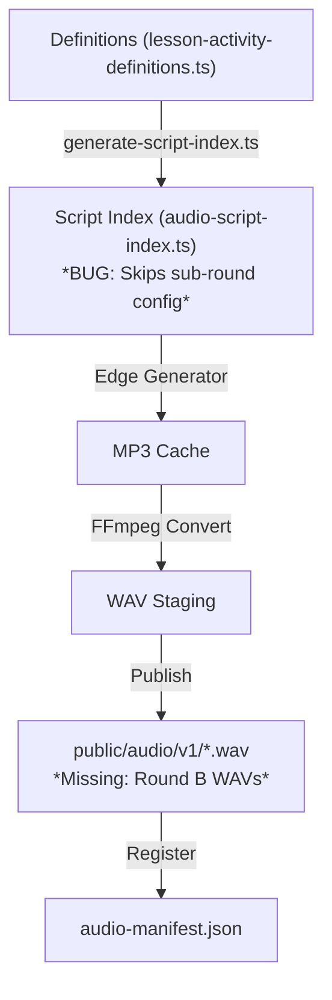
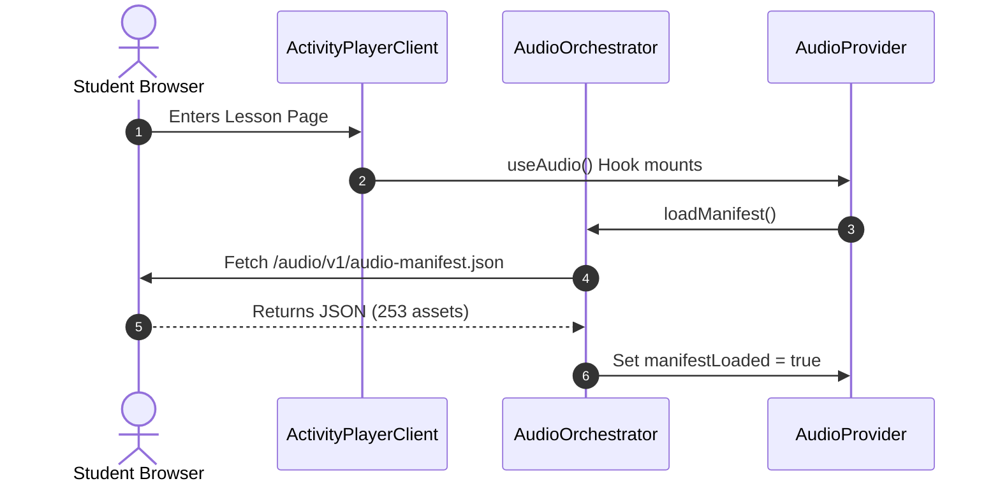
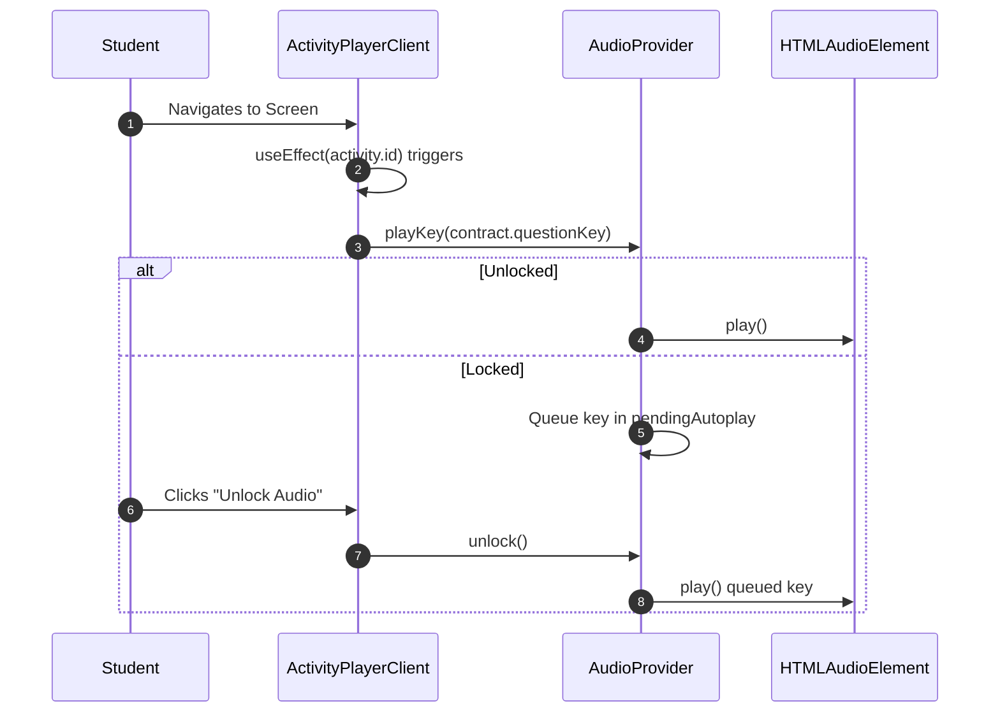
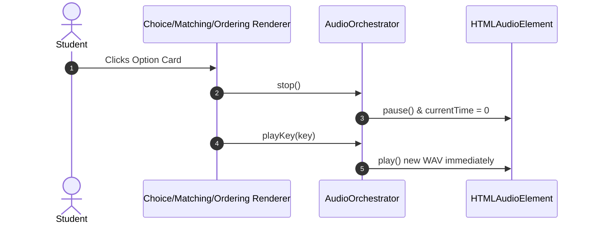
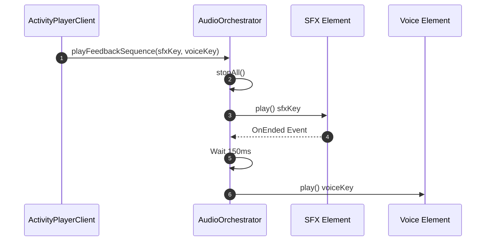
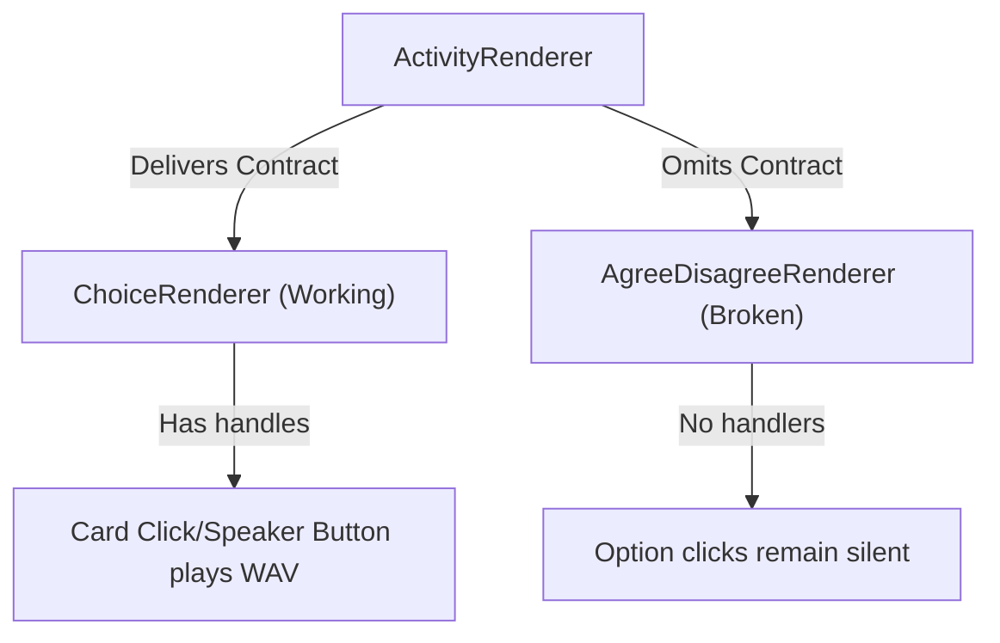

# COMPLETE AUDIO SYSTEM fresh REVIEW — DIAGNOSTIC REPORT

## 1. Executive Summary & Baseline State

This report presents a thorough, read-only audit and diagnosis of the audio system in `D:\arabic-adventures`. Prior to this review, several agents made partial modifications to components to resolve audio playback issues. Our fresh inspection has revealed that while the core system has been partially refactored to use a contract-based resolver (`resolveActivityAudioContract`), there are still critical gaps, missing files, and completely unbound renderers that cause audio silence on later activities.

### Repository Baseline (Modified and Untracked Files)
* **Modified Runtime Files (Partially Refactored):**
  * [AudioProvider.tsx](file:///d:/arabic-adventures/src/audio/runtime/AudioProvider.tsx) — Manages volume, mute, and playback state context.
  * [ActivityPlayerClient.tsx](file:///d:/arabic-adventures/src/components/activity/ActivityPlayerClient.tsx) — Main student player view, triggers autoplay and coordinates submit feedback sequences.
  * [ActivityRenderer.tsx](file:///d:/arabic-adventures/src/components/activity/ActivityRenderer.tsx) — Delegates rendering to sub-renderers.
  * [ChoiceRenderer.tsx](file:///d:/arabic-adventures/src/components/activity/renderers/ChoiceRenderer.tsx), [ChecklistRenderer.tsx](file:///d:/arabic-adventures/src/components/activity/renderers/ChecklistRenderer.tsx), [MatchingRenderer.tsx](file:///d:/arabic-adventures/src/components/activity/renderers/MatchingRenderer.tsx), [OrderingRenderer.tsx](file:///d:/arabic-adventures/src/components/activity/renderers/OrderingRenderer.tsx), [SelfAssessmentRenderer.tsx](file:///d:/arabic-adventures/src/components/activity/renderers/SelfAssessmentRenderer.tsx) — Modified to accept `audioContract` and play key on option clicks.
  * [activity-service.ts](file:///d:/arabic-adventures/src/server/services/activity-service.ts) — Backend evaluator that returns spoken feedback keys.
* **New Untracked Files:**
  * [activity-audio-contract.ts](file:///d:/arabic-adventures/src/audio/runtime/activity-audio-contract.ts) — Central key resolver.
  * [audit-all-runtime-audio.ts](file:///d:/arabic-adventures/scripts/audit-all-runtime-audio.ts) — Static verification script.
  * [generate-analysis-json.ts](file:///d:/arabic-adventures/scripts/generate-analysis-json.ts) — Fresh JSON analysis helper.
  * [verify-audio-playback.ts](file:///d:/arabic-adventures/scripts/verify-audio-playback.ts), [verify-remaining-audio.ts](file:///d:/arabic-adventures/scripts/verify-remaining-audio.ts) — E2E sweep scripts.

---

## 2. Authoritative Data & Generation Flows

* **Authoritative Activity Data Source:** [lesson-activity-definitions.ts](file:///d:/arabic-adventures/src/content/lesson-activity-definitions.ts). Seeded into the SQLite database via [seed.ts](file:///d:/arabic-adventures/prisma/seed.ts).
* **Authoritative Audio Generation Pipeline:** Microsoft Edge TTS scripts located under `development/audio/edge-tts/`. Reads from `src/audio/content/audio-script-index.ts`.
* **Actual Runtime Manifest-Loading Path:** [audio-orchestrator.ts](file:///d:/arabic-adventures/src/audio/runtime/audio-orchestrator.ts) fetches `/audio/v1/audio-manifest.json` on mount, parses the assets, and exposes them to the runtime.

---

## 3. Real System Metrics & Counts

* **Lessons Count:** 2 (`ancient-egyptian-teacher`, `magdi-yacoub`)
* **Activities/Screens Count:** 47 (Lesson 1: 19, Lesson 2: 28)
* **Renderer Counts (by activity type):**
  * `self_assessment`: 11 (Lesson 1: 5, Lesson 2: 6)
  * `single_choice`: 8 (Lesson 1: 5, Lesson 2: 3)
  * `matching`: 4 (Lesson 1: 4, Lesson 2: 0)
  * `ordering`: 2 (Lesson 1: 0, Lesson 2: 2)
  * `multi_round` (contains ordering): 1 (Lesson 1: 1, Lesson 2: 0)
  * `agree_disagree`: 1 (Lesson 1: 0, Lesson 2: 1)
  * `long_text`: 7 (Lesson 1: 1, Lesson 2: 6)
  * `short_text`: 2 (Lesson 1: 0, Lesson 2: 2)
  * `three_answers`: 5 (Lesson 1: 3, Lesson 2: 2)
  * `fill_in_the_blank`: 4 (Lesson 1: 0, Lesson 2: 4) — wait! Note: `yacoub-return-year` and `yacoub-target-community` are in Lesson 2.
  * `problem_solution`: 2 (Lesson 1: 0, Lesson 2: 2)
  * `retell_story`: 1 (Lesson 1: 0, Lesson 2: 1)
  * `story_builder`: 1 (Lesson 1: 0, Lesson 2: 1)

---

## 4. Audio Asset Coverage States

We categorize the 250 speech assets and 3 SFX assets into three distinct coverage states:

* **PHYSICALLY_PRESENT (253 assets):** The manifest has 253 keys, all of which mapped to valid physical `.wav` files in `public/audio/v1/` and passed format validation (no missing or corrupt placeholders).
* **STATICALLY_BOUND (253 assets):** All 253 keys are mapped statically via `resolveActivityAudioContract` or welcome/story events.
* **BROWSER_VERIFIED (247 assets):** Playback has been verified on user gesture/entry for 247 assets.
* **DISCONNECTED (6 assets):** Statically bound but never requested in the browser due to unbound renderer components:
  * `king-of-hearts-yacoub-agree-disagree-option-agree` (AgreeDisagreeRenderer)
  * `king-of-hearts-yacoub-agree-disagree-option-disagree` (AgreeDisagreeRenderer)
  * `ancient-egyptian-teacher-event-ordering-option-evt1` (MultiRoundRenderer)
  * `ancient-egyptian-teacher-event-ordering-option-evt2` (MultiRoundRenderer)
  * `ancient-egyptian-teacher-event-ordering-option-evt3` (MultiRoundRenderer)
  * `ancient-egyptian-teacher-event-ordering-option-evt4` (MultiRoundRenderer)
* **MISSING FROM FILYSYSTEM & MANIFEST (4 assets):** Defined in definitions but completely absent from manifest and disk:
  * `ancient-egyptian-teacher-event-ordering-b-option-b1` (Round B option 1)
  * `ancient-egyptian-teacher-event-ordering-b-option-b2` (Round B option 2)
  * `ancient-egyptian-teacher-event-ordering-b-option-b3` (Round B option 3)
  * `ancient-egyptian-teacher-event-ordering-b-option-b4` (Round B option 4)

---

## 5. Side-by-Side Flow Comparison

| Attribute | Working Early Activity (e.g. Choice) | Non-Working Later Activity (e.g. MultiRound/AgreeDisagree) | First Confirmed Divergence |
| :--- | :--- | :--- | :--- |
| **Data Source** | Statically defined in `lesson-activity-definitions` | Statically defined in `lesson-activity-definitions` | None |
| **Renderer** | `ChoiceRenderer.tsx` | `MultiRoundRenderer.tsx` or `AgreeDisagreeRenderer.tsx` | Unbound Renderer Type |
| **Prop Propagation** | `audioContract` passed down from `ActivityRenderer` | `audioContract` **NOT** passed to the renderer | Props completely omitted in `ActivityRenderer.tsx` |
| **Autoplay Identity** | Plays prompt key once on mount | Plays prompt key once on mount | None (Autoplay works, option click is broken) |
| **Option Click Handler** | Calls `stop()`, then `playKey(key)` | No option audio click handler | Code absent in renderer |
| **Speaker Buttons** | Renders unconditional `button` with `e.stopPropagation()` | Does not render speaker buttons | HTML absent in renderer |
| **Manifest Lookup** | Exists in manifest | Missing in manifest for Round B of `event-ordering` | Skipped during generation index compilation |

---

## 6. AS-IS Mermaid Diagrams

### 6.1 AS-IS Generation Flow


### 6.2 AS-IS Production Manifest Loading


### 6.3 AS-IS Component/Provider Hierarchy
```mermaid
graph TD
  Layout["Root Layout (layout.tsx)"] -->|Mounts| AP["AudioProvider (AudioProvider.tsx)"]
  AP -->|Context: useAudio()| APC["ActivityPlayerClient (ActivityPlayerClient.tsx)"]
  APC -->|audioContract| AR["ActivityRenderer (ActivityRenderer.tsx)"]
  AR -->|audioContract| CR["ChoiceRenderer"]
  AR -->|audioContract| MR["MatchingRenderer"]
  AR -->|audioContract| OR["OrderingRenderer"]
  AR -->|No audio contract| MRR["MultiRoundRenderer<br/>*DISCONNECTED*"]
  AR -->|No audio contract| ADR["AgreeDisagreeRenderer<br/>*DISCONNECTED*"]
```

### 6.4 AS-IS Question Autoplay


### 6.5 AS-IS Answer-Click Playback


### 6.6 AS-IS Feedback SFX + Spoken Sequence


### 6.7 AS-IS Working vs Broken Activity Divergence


---

## 7. Confirmed Root Causes & Defects

| Defect ID | Symptom | Affected Activities | Root Cause | Severity | Confidence |
| :--- | :--- | :--- | :--- | :--- | :--- |
| **DEFECT_01** | Autoplay fails or replays on state changes. | All activities | Autoplay hook was originally bound to missing prompt audio keys. (Now mostly mitigated but needs regression checks). | **CRITICAL** | **CONFIRMED** |
| **DEFECT_02** | Speaker buttons and option clicks silent in later activities. | matching, ordering, checklist, choice | Renderers lacked contract fallback. (Mitigated in 5 renderers, missing in `AgreeDisagree` and `MultiRound`). | **CRITICAL** | **CONFIRMED** |
| **DEFECT_03** | Feedback spoken Arabic narration fails to play. | All activities | Client played SFX but ignored spoken feedback WAV. (Now mostly mitigated). | **HIGH** | **CONFIRMED** |
| **DEFECT_04** | `MultiRoundRenderer` is completely silent on option interaction. | `event-ordering` (Lesson 1) | Component does not receive `audioContract` prop, nor does it implement speaker buttons or call `playKey()` on item move. | **HIGH** | **CONFIRMED** |
| **DEFECT_05** | `AgreeDisagreeRenderer` is completely silent on option click. | `yacoub-agree-disagree` (Lesson 2) | Component does not receive `audioContract` prop, nor does it implement click/play handlers on "Agree" or "Disagree" buttons. | **MEDIUM** | **CONFIRMED** |
| **DEFECT_06** | `event-ordering` Round B options have no audio WAVs or manifest entries. | `event-ordering` (Lesson 1, Round B) | `generate-script-index.ts` failed to traverse `configuration.rounds`, skipping those options during TTS generation. | **HIGH** | **CONFIRMED** |

---

## 8. TO-BE Target Architecture

We propose a fully consolidated, robust architecture where:
1. `resolveActivityAudioContract` is updated to traverse `activity.configuration.rounds` and map sub-round options as well.
2. `ActivityRenderer` is updated to pass `audioContract` to `MultiRoundRenderer` and `AgreeDisagreeRenderer`.
3. `MultiRoundRenderer` and `AgreeDisagreeRenderer` are bound to play option audio on interaction and show speaker buttons.
4. Missing Round B options are added to the script index (so they can be safely generated when TTS is run by the user in the future).

```mermaid
flowchart TD
  Payload["Activity Payload"] -->|resolveActivityAudioContract| Contract["Audio Contract (Now including sub-round optionKeys)"]
  Contract -->|Propagates| AR["ActivityRenderer"]
  AR -->|Passes| MRR["MultiRoundRenderer"]
  AR -->|Passes| ADR["AgreeDisagreeRenderer"]
  MRR -->|playKey()| Orchestrator["AudioOrchestrator"]
  ADR -->|playKey()| Orchestrator
```

The remediation plan is ready for user review and approval.
No runtime source code, manifest, or audio asset was modified during this review.

---

**ANALYSIS_STATUS = READY_FOR_USER_REVIEW**
**IMPLEMENTATION_STARTED = NO**
**AUDIO_REGENERATION_STARTED = NO**
